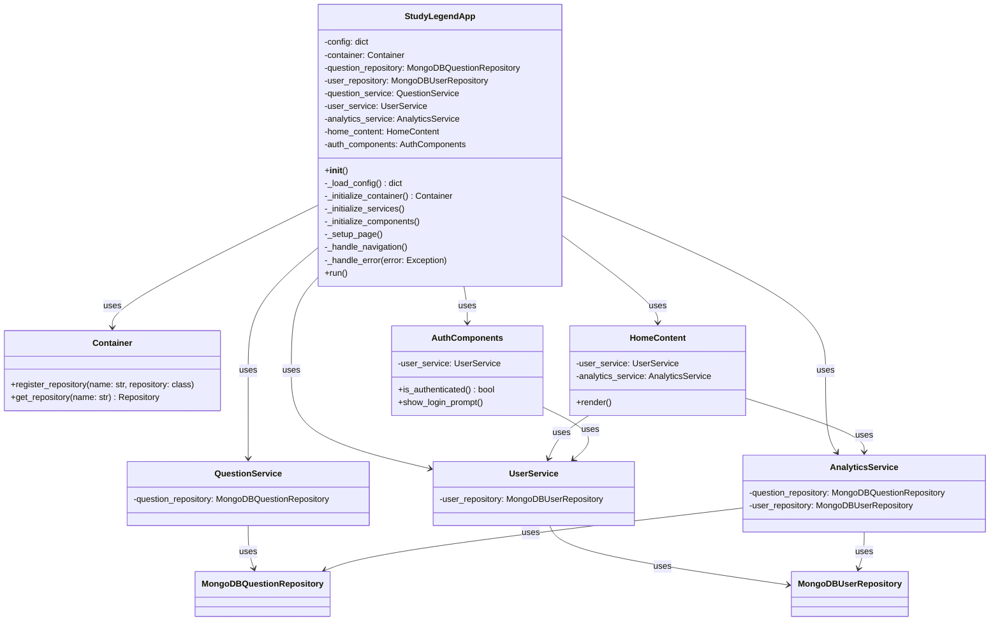
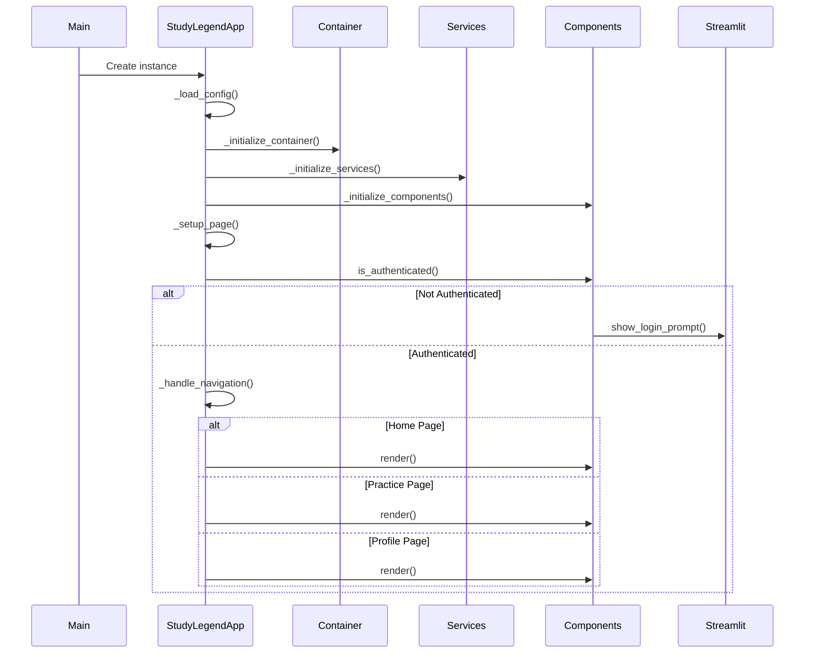

# Home.py Documentation

## Class Diagram

## Application Flow Sequence Diagram

## Key Components

### StudyLegendApp
The main application class that orchestrates the entire application. It handles:
- Configuration loading
- Dependency injection
- Service initialization
- Component initialization
- Page navigation
- Error handling

### Container
Manages dependency injection and repository registration.

### Services
- **QuestionService**: Handles question-related operations
- **UserService**: Manages user-related operations
- **AnalyticsService**: Handles analytics and reporting

### Components
- **HomeContent**: Renders the home page content
- **AuthComponents**: Manages authentication and user sessions

## Error Handling
The application implements comprehensive error handling with:
- Logging at different levels (INFO, DEBUG, ERROR, CRITICAL)
- Business exception handling
- Debug mode for detailed error information
- Graceful error presentation to users

## Configuration
The application uses environment variables for configuration:
- MongoDB connection URI
- Database name
- Debug mode
- Log level
- Maximum connections

## Navigation
The application supports multiple pages:
- Home
- Practice
- Profile

Navigation is handled through Streamlit query parameters. 